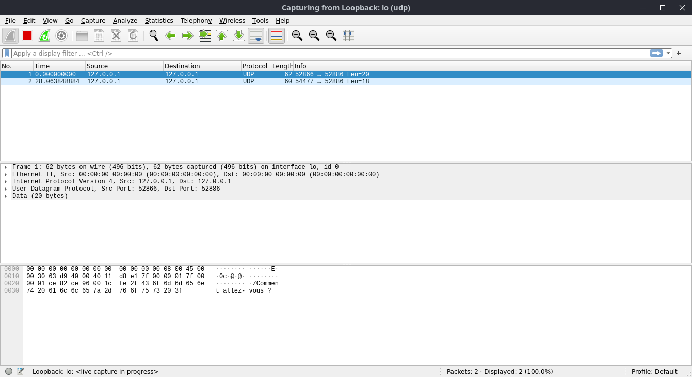
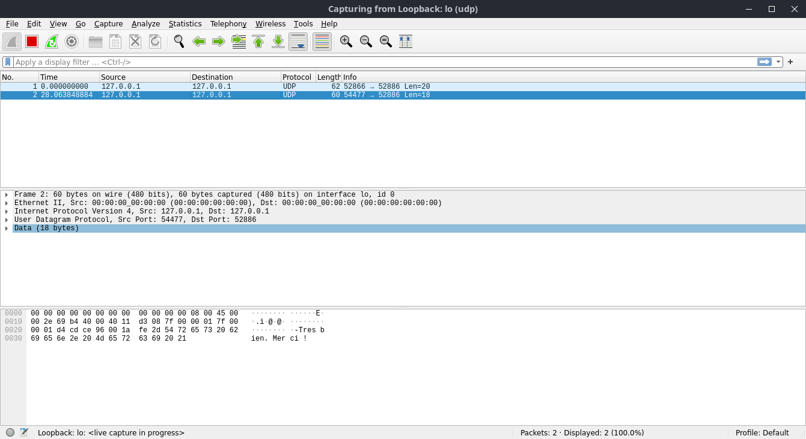

# 
 Rapport pour le TP1 

## 
 PARTIE 1 : Le protocol UDP 

#

> **Question 1 :**

- L'adresse ipv4 est 192.168.5.66/24

> **Question 2 à 7, 9:**

> **Question 8 :**

- Pour éviter tout conflit de ports, il est préférable de laisser la machine choisir automatiquement un port libre. 

> **Question 10 à 14 :**

> **Question 15 a :**

> **Question 15 b :**

> **Question 15 c :**

-    Sur le message envoyé composé de 20 caractères, on remarque que wireshark détecte 5 segments (Datagrammes).

1) Frame 1:  Couche physique
2) Ethernet II : Couche liaison 
3) IPV4 : Couche réseau 
4) UDP : Couche Transport
5) Data : Données

> **Question 15 d :**

- Pour le premier message l'efficacité est de ( 20 / 62 ) = 0.32 . Avec 20 étant la taille du message et 62 la taille de la trame.

- Pour le second message l'efficacité est de ( 18 / 60 ) = 0.30 . Avec 18 étant la taille du message et 60 la taille de la trame

#

 

## PARTIE 2:  Le protocol TCP

 

#

> **Question 1 et 4 :**

- Nous constatons que la connexion a été refusé message erreur :  "connect(): Connection refused".

- Concernant Wireshark rien de spécial à signialer. 

> **Question 2 :**

- On peut voir grâce à wireshark que la connexion a échoué. 

> **Question 3 :**

>**Question 6 :**

- la commande suivante nous permet de mettre un socket en écoute. 
    
        listen id_socket> <nb_connexions> 

- Ici nous avons mis le socket 4 en écoute. Ainsi on peut dire que le socket 4 est le serveur est le socket 3 est le client. 

>**Question 7 :**

- Sur wireshark on constate que la connexion a bien été établit. 

>**Question 9 :**

- Après avoir accepté la connexion on constat grace à la commande status qu'un nouveau socket ayant pour ID 5 est créer. 

>**Question 10 :**
- Nous venons de lancer la commande suite pour envoyer un message avec le socket 3.

        write 3 "Comment allez-vous ?"

> **Question 11a :**

- Le flag Push ???

> **Question 11b :**

- Les segements son numeroté car il peuvent ne pas arriver dans le bon ordre. Le numéro de séquence conrespond au numéro du dernier segement envoyé. Ici le numéro de séquence est 1 .  

> **Question 11c :**

- Le numéro d'aquitement correspond au numéro du prochain segment attendu. Ici nous avons envoyé un segment avec un numéro "next sequence number : 21" si le message à bien été reçu alors le numéro d'aquitement sera 21. C'est bien ce que l'on observe avec wireshark.

> **Question 11d :**

- Grace a wireshark, nous connaisson les numéros d'aquitement et de séquence. La différence entre c'est cest deux numéro corespond à la taille de notre message. 21 - 1 = 20. nous avons envoyé le message suivant "Comment allez-vous ?" de 20 caractères.

> **Question 12 :**

- Comme on peux le voir sur le terminal, le champ Recv-Q contient le chiffre 20. Ce qui conrespond au nombre de caractères de notre message. 

> **Question 13 :** 

- La commande suivante nous permet de lire le message reçu. 

        read 5 20 

- On constate que le socket sur le quel on lis les données est le socket qui nous est données par la commande accept

> **Question 14 :** 

- De nouveau sur le terminal on se rend compte que le champ Recv-Q est désormais à 0 car nous avons lu le comptenu du message .  

> **Question 15 :** 

- La commande suivante permet de mettre fin à la connexion tcp dans un sens. On peut d'ailleur observer sur wireshark qu'un segment portant le flag "FIN" à été envoyé. et un message d'aquitement à été reçu. Ce qui signifie que la connexion TCP à bien pris fin dans ce sens.

        shutdown 3 out

> **Question 16 :** 

> **Question 17 :** 

- La commande shutdown permet d'envoyer un segment qui met fin à la connexion. 

> **Question 18a:** 

        il faut reprendre le shhéma sur le tp est completer à l'aide des screen wiresark. ce qui est noté en dessous c'est juste pour indication il devra être supprimé. 

- 4000 -> 3000 syn
- 3000 -> 4000 ack
- ---
- 3000 -> 4000 psh
- 4000 -> 3000 ack
- ---
- 3000 -> 4000 fin
- 4000 -> 3000 ack
- ---
- 4000 -> 3000 psh
- 3000 -> 4000 ack
- ---
- 4000 -> 3000 fin
- 3000 -> 4000 ack

> **Question 18b:** 
- Avec TCP on comptabilise 10 segments transmis.Contrairement à udp ou seul 2 segements on été transmis. 

> **Question 18 c :** 
- Il faut faire le même calcule que pour UDP

#

 

## PARTIE 3 :  Retransmissions et contrôle de flux

 

#

> **Question 3 :** 

> **Question 4 :** 
- La longueur du message est la même que le précédent, il n a pas eu d'incrémentaiton 

> **Question 6 :** 

> **Question 7 :** 

- L'éxpediteur envoie beaucoup d'informations 

> **Question 8a :** 

        113	366.005383787	127.0.0.1	127.0.0.1	TCP	66	[TCP ZeroWindow] 4000 → 3000 [ACK] Seq=1 Ack=264927 Win=0 Len=0 TSval=1251659832 TSecr=1251659608

        112	366.005360891	127.0.0.1	127.0.0.1	TCP	66	[TCP Keep-Alive] 3000 → 4000 [ACK] Seq=264926 Ack=1 Win=512 Len=0 TSval=1251659832 TSecr=1251659608

> **Question 8b :**
- Il continue d'essayer d'envoyer un message 

> **Question 8c :**
- Lorsqu'on a vidé le buffer, d'autres messages on été reçu.  

> **Question 8d :**
- Non cetrains messages n'ont pas eu d'aquitement 