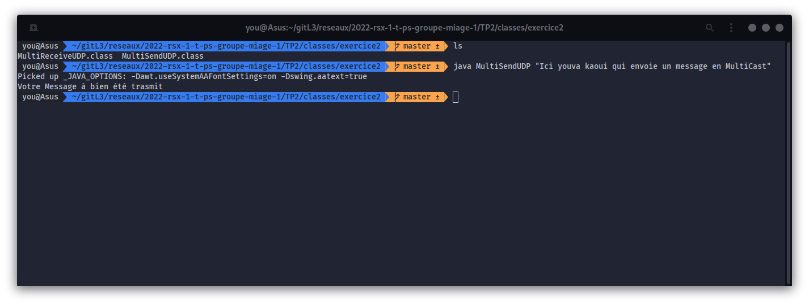

KAOUI 

Youva

L3 Informatique - MIAGE

# Rapport pour le TP2
Le but de TP est de réaliser un client de discussion qui utilise le protocole UDP en Multicasting. Ce service de
discussion en ligne ne nécessitera donc pas la présence d'un serveur centralisant toutes les communications.

- Voici le contenu du TP2 :

```bash
.
├── Makefile
├── README.md
└── src
    ├── exercice1
    │   ├── ReceiveUDP.java
    │   └── SendUDP.java
    ├── exercice2
    │   ├── MultiReceiveUDP.java
    │   └── MultiSendUDP.java
    ├── exercice3
    │   ├── ChatAPP.java
    │   ├── Receiver.java
    │   └── Sender.java
    └── exercice3V2
        ├── ChatApp.java
        ├── ClientServerChat.java
        └── Role.java

5 directories, 12 files

```   
________________________________________________________
________________________________________________________

> ## Exercice 1 : Protocole UDP
Dans cet exercice nous allons faire une application permettant d'envoyer un paquet UDP vers un utilisateur donné.
Les classes java SendUDP.java et ReceiveUDP.java permettent respectivement de d'envoyer un message et de recevoir un message. 

**Fonctionement :** 
- Compilation des classes SendUDP.java et ReceiveUDP.java. Se placer dans le dossier /TP2 dans un términal exécuter la commande suivante:
    ```bash
    $ make exo1
    ```
- un dossier "classes" sera disponible à la racine du TP2, il faut alors se placer dans le dossier "classes/exercice1", la commande suivante vous permet de vous déplacer jusqu'au dossier: 

    ```bash
    $ cd classes/exercice1/
    ```
- une fois dans le dossier vous aurez à votre disposition 2 fichiers SendUDP.class et ReceiveUDP.class. Afin de lancer les classes il faut ouvrir deux terminaux et lancer les commandes suivantes:
    * TERMINAL 1 : Se mettre en écoute
        ```bash
        $ java ReceiveUDP <PORT>
        ``` 
         

    * TERMINAL 2 : Envoyer un message
        ```bash
        $ java SendUDP <IP_DESTINATAIRE> <PORT>  <"Votre_Message">
        ```
        

    * Au besoin: Pour connaitre votre adresse IP vous pouvez utiliser la commande suivante 
        ```bash
        $ ip addrs
        ```

________________________________________________________
________________________________________________________

> ## Exercice 2 : Multicast UDP
Dans cet exercice nous allons faire une application permettant d'envoyer un paquet UDP en Multicast.
Les classes java SMultiSendUDP.java et MultiReceiveUDP.java permet respectivement d'envoyer un message et de recevoir un message. 

**Fonctionement :** 
- Compilation des classes MultiSendUDP.java et MultiReceiveUDP.java . Se placer dans le dossier /TP2 dans un términal exécuter la commande suivante:
    ```bash
    $ make exo2
    ```
- Un dossier "classes" sera disponible à la racine du TP2, il faut alors se placer dans le dossier "classes/exercice1", la commande suivante vous permet de vous déplacer jusqu'au dossier: 

    ```bash
    $ cd classes/exercice2/
    ```

- une fois dans le dossier vous aurez à votre disposition 2 fichiers MultiSendUDP.class et MultiReceiveUDP.class. Afin de lancer les classes il faut ouvrir deux terminaux et lancer les commandes suivantes: 
    * TERMINAL 1 : Se mettre en écoute
    ```bash
    $ java MultiReceiveUDP
    ``` 
    


    * TERMINAL 2 : Envoyer un message
    ```bash
    $ java MultiSendUDP <"Votre_Message">
    ```
    

    >  Réponse aux questions 

    - Q1. Quelles sont les étapes pour émettre et recevoir un paquet UDP multicast sur le réseau local ?

        **- Créer un socket multicast**

        **- Créer un message et l'envoyer sous forme de paquet**

        **- Fermer le socket**

    - Q2. Quelles sont les exceptions à traiter pour chaque étape du programme d'émission et de réception ?

        **- Verifier que les arguments sont corrects**

________________________________________________________
________________________________________________________
> ## Exercice 3 : Programme de Tchat
Dans cet exercice nous allons faire une application ChatApp.java permettant d'envoyer un paquet UDP en Multicast.
La classe ChatApp.java utilise les classes MultiSendUDP.java et MultiReceiveUDP.java de l'exercice2. Les classes ont été modifiées pour les besoins de l'exercice 3

**Fonctionement :** 
- Compilation des classes MultiSendUDP.java et MultiReceiveUDP.java . Se placer dans le dossier /TP2 dans un términal exécuter la commande suivante:
    ```bash
    $ make exo3
    ```
- les classes compilées se trouvent dans le dossier classes/exercice3. Pour les lancer il faut utiliser le makefile présent dans la racine du TP2

    ```bash
    $ make runExo3
    ```
    

    >  Réponse aux questions 

    - Q1. Comment réaliser un client capable d'émettre et de recevoir des paquets UDP simultanément ?

        **- Pour réaliser cette fonctionnalité il va falloir utiliser 2 threads**

    - Q2. Chaque message arrivant de machines différentes, on souhaite pouvoir associer un nom symbolique à chaque machine. Proposer une solution pour que chaque message soit associé au minimum à un nom de machine, et au mieux d'utilisateur afin qu'il soit plus facile de suivre les conversations.

        **- Pour répondre à cette question j'affiche le nom de l'utilisateur ayant emis le message**

> ## Exercice 3 : Programme de Tchat V2

- Une autre version de l'exercie 3 est disponible dans le dossier TP2/src/exercice3V2. Cette version n'était pas demandée dans le sujet. Je n'ai donc pas indiqué les méthodes d'éxécution. 

