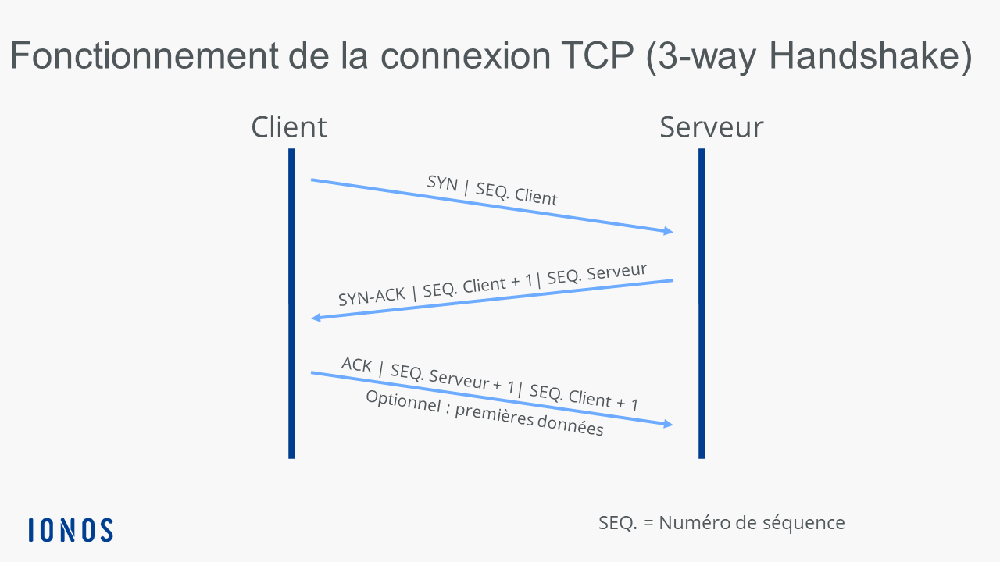
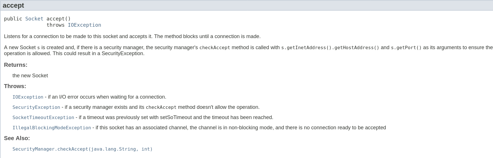
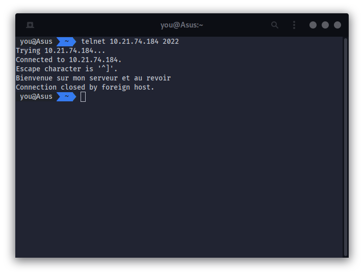
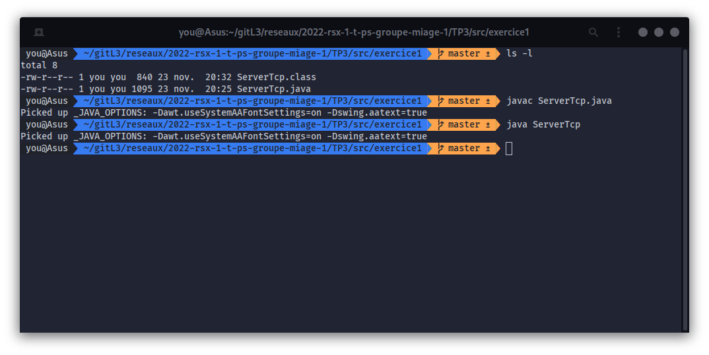
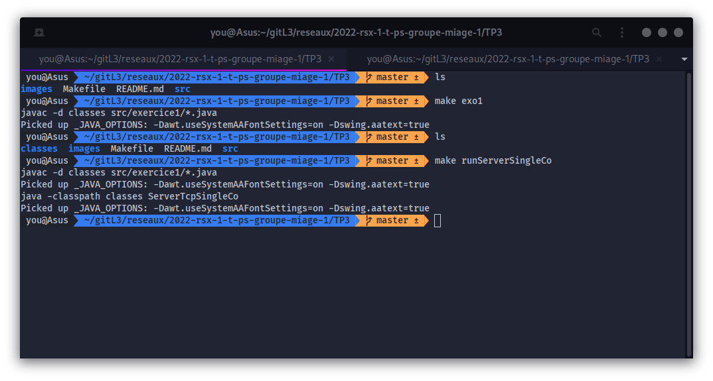
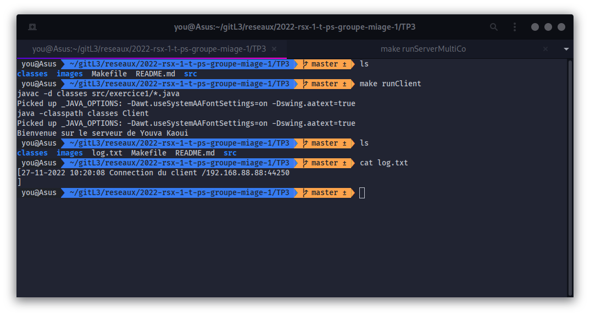

KAOUI 

Youva

L3 Informatique - MIAGE

# Rapport pour le TP3
Le but de TP est de réaliser un serveur de dialogue centralisé qui utilise désormais le protocole TCP. Ce service
de discussion en ligne acceptera plusieurs clients, et servira de relais pour la communication entre ces clients.

- Voici le contenu du TP3 :

```bash
tree


```   

________________________________________________________
________________________________________________________


> ## Exercice 1 : Première expérience
Dans cet exercice nous allons créer un serveur TCP qui accepte en permanence des connections, et pour chacune, envoie au client le message « Bienvenue sur mon serveur et au revoir » avant de rompre immédiatement la communication.

> Fonctionement

- Compilation des classes ServerSingleCo.java et ServerMultiCo.java. Se placer dans le dossier /TP3 dans un términal exécuter la commande suivante:

    ```bash
    $ make exo1
    ```

- un dossier "classes/exercice1" sera disponible à la racine du TP3. Ce dossier contient les classes ServerTcpSingleCo, ServerTcpMultiCo et Client.

    - lancement de ServerTcpSingleCo

        ```bash
            $ make runServerSingleCo
        ```

    - lancement de ServerTcpMultiCo

        ```bash
            $ make runServerTcpMultiCo
        ```

    - lancement du Client

        ```bash
            $ make runClient
        ```
________________________________________________________
________________________________________________________


>  Réponse aux questions 

- Q1. Quelles sont les étapes du traitement d'une requête ?

    

   
    -   **1) Le client ouvre la communication et envoie un premier paquet SYN au serveur**

    -   **2) A la reception du paquet le serveur renvoie un paquet approuvant la connexion SYN-ACK**

    -   **3) Le client confirme la reception du paquet d'aquitement envoyé par le serveur en envoyant à sont tour un paquet d'aquitement ACK**


- Q2. Quelles sont les exceptions à traiter pour chaque étape de votre programme ? S'assurer que chacune est bien affiché à l'administrateur du serveur.

    **Voici la liste des exceptions que l'on peux rencontrer ainsi que leur significations**


    
    
    **Grace à un try-catch les erreurs s'affichent à l'administrateur du serveur**

- Q3. Une fois le programme réalisé, comment tester son bon fonctionnement ?

    
    

    **On peux tester le programme grace à tetlnet, qui nous permet d'établir une connexion TCP sur le port 2022. "Dans cette version le serveur ne peut recevoir qu'une seul connexion"**

- Q4. S'assurer que le programme fonctionne en boucle, c'est-a-dire, qu'il traite plusieurs requêtes les unes après les autres. Ce faisant, le serveur peut recevoir une succession de requêtes de différents clients : comment garder la trace toutes les connections ayant eu lieu ?

    
    

**Dans cette version le serveur peux recevoir plusieurs connexions en boucle, j'ai créer un client de connexion pour faciliter l'éxecution.**

**Chaque connexion établi au serveur s'affiche dans le terminal et elle est gardée dans un fichier log.txt à la racine du projet. Aisi nous avons une trace permanante comprenant la date, l'heure, l'ip du client et le port qu'il utilise**


> ## Exercice 2 : ????
L'objectif est ici de faire évoluer le serveur de sorte qu'il accepte simultanément plusieurs connexions. L'idée est de permettre à chaque client qui se connecte d'avoir la possibilité d'envoyer des messages qui seront alors reçus de tous les clients actuellement connectés.

>  Réponse aux questions 

- Q1. Comment et quand créer un nouveau Thread pour un client dans votre programme ?

**Nous alons devoir faire extend notre classe actuelle par la classe Thread de Java, par la suite pour chaque nouvelle connexion d'un client nous lui affecterons un nouveau thread**

- Q2. Quelles sont les primitives permettant de recevoir des chaines de caractères sur une Socket ?

**La méthode getInputStream() permet de recevoir un flux entrant de donnés, il faut ensuite le traiter...**

- Q3. Comment faire pour retransmettre ces chaines vers tous les utilisateurs connectés ? Comment partager en Java, au niveau du constructeur de chaque Thread, une structure globale visible et mise à jour par tous les Threads ?

**nous pouvons définir une classe statique appelée "ThreadManager" qui contiendra une liste de tous les Threads connectés. Chaque Thread peut alors y ajouter et supprimer des Threads de la liste. Cette liste peut être utilisée pour retransmettre des messages à tous les Threads connectés.**

- Q4. S'assurer que le programme fonctionne en boucle, c'est-a-dire, qu'il traite plusieurs requêtes les unes après les autres. Ce faisant, le serveur peut recevoir une succession de requêtes de différents clients : comment garder la trace toutes les connections ayant eu lieu ?

**Une solution consiste à créer une liste ou un tableau qui contient toutes les connexions courantes et à le partager entre les threads. puis on peux stocker cette liste dans un fichier log**

- Q5. Lorsqu'un client telnet quitte normalement (CTRL-D), ou alors est intempestivement arrêté, comment s'assurer du bon fonctionnement de l'application

**Pour s'assurer du bon fonctionnement de l'application, il est important de tester si les sockets sont toujours actives et de les fermer si elles ne le sont pas. On peut par exemple implémenter un Thread supplémentaire qui surveille les sockets et les ferme si elles ne répondent pas dans un délai raisonnable. De plus, il est important de vérifier que le contenu des messages reçus par le serveur est correct pour éviter toute erreur de traitement.**