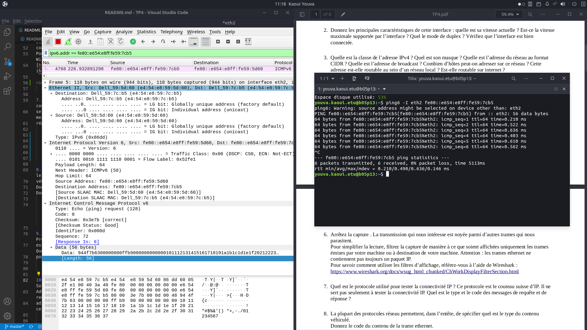
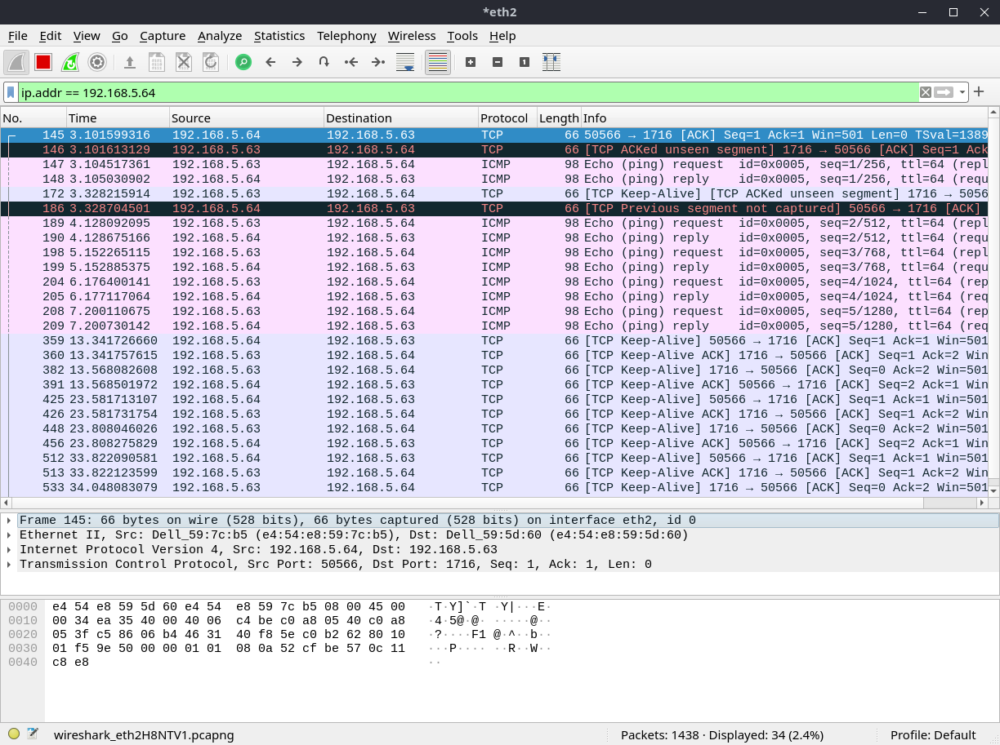
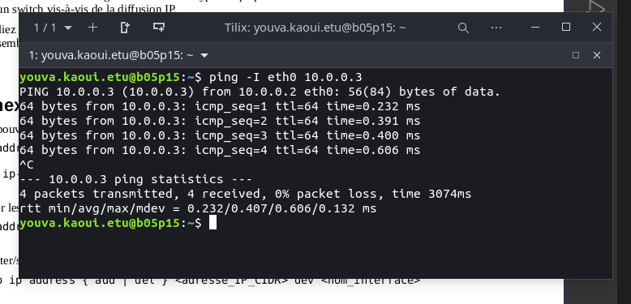

# Rapport pour le TP4 : Liaison de données


## Adressage

1. Sur votre machine, quel est le nom de l’interface connectée au réseau de la salle de TP ? Quelle est son
adresse IPv4 ? Quelle est son adresse IPv6 ? Quelle est son adresse MAC ?
    

2. Donnez les principales caractéristiques de cette interface : quelle est sa vitesse actuelle ? Est-ce la vitesse maximale supportée par l’interface ? Quel le mode de duplex ? Vérifiez que l’interface est bien connectée.

    **la vitesse max et la vietsse actuelle sont les mêmes (speed : 1000mbps)**
    

3. Quelle est la classe de l’adresse IPv4 ? Quel est son masque ? Quelle est l’adresse du réseau au format CIDR ? Quelle est l’adresse de broadcast ? Combien d’hôtes peut-on adresser sur ce réseau ? Cette adresse est-elle routable au sein d’un réseau local ? Est-elle routable sur internet ?

    **l'ipv4 est de classe C.** 
    **Sont masque est de 255.255.255.0 au format CIDR /24.** 
    **l'adresse de Broadcast est 192.168.5.255.** 
    **Il est possible d'adresser 255 appareille téhorique en retirant les adresses réservées il reste 255-2 = 252.**
    **Cette adresse est routable uniquement en local et jamais sur internet**
    

4. Écrivez les 16 octets de l’adresse IPv6 sans abréviation. Écrivez en dessous les 16 octets du masque.Combien d’hôtes peut-on adresser sur ce réseau ? Cette adresse est-elle routable au sein d’un réseau local ? Est-elle routable sur internet ? Quelle est l’étendue (scope) de cette adresse ?


    **L'ip v6 est fe80 0000 0000 0000 e654 e8ff fe59 67ee**
    **le mask = FFFF:FFFF:FFFF:FFFF:0000:0000:0000**

    **Sur ce reseau on peux y mettre 2³(128) -1**


   Affichez la table de routage. Quelle est l’adresse de la passerelle IP ?

    **l'adresse de la gateway est 192.168.5.1**
    

5. Avec Wireshark, lancez une capture de trames sur l’interface connectée au réseau de la salle de TP.
Testez la connectivité IPv4 et IPv6 avec votre voisin.
    
    
    
    

6. Arrêtez la capture . La transmission qui nous intéresse est noyée parmi d’autres trames qui nous parasitent.Pour simplifier la lecture, filtrez la capture de manière à ce que soient affichées uniquement les trames émises par votre machine ou à destination de votre machine. Attention : les trames ethernet ne contiennent pas toujours un paquet IP. Pour savoir comment utiliser les filtres d’affichage référez-vous à l’aide de Wireshark : [ICI](https://www.wireshark.org/docs/wsug_html_chunked/ChWorkDisplayFilterSection.html)
    
    **Remplacez cette phrase avec votre réponse.**

7. Quel est le protocole utilisé pour tester la connectivité IP ? Ce protocole est le couteau suisse d’IP. Il ne sert pas seulement à tester la connectivité IP. Quel est le type et le code des messages de requête et de réponse ?

    **Le protocole est l'ICMP, il permet aussi de connaitre la vitesse de comunication entre deux appareilles**

8. La plupart des protocoles réseau permettent, dans l’entête, de spécifier quel est le type du contenu véhiculé.
Donnez le code du contenu de la trame ethernet.
Donnez le code du contenu du paquet IP.

   **Les paquets IP transmis à votre voisin sont encapsulés dans des trames ethernet. Pour que ces trames parviennent à destination, il faut connaître l’adresse ethernet de votre voisin. Cette adresse est aussi appelée adresse matérielle ou adresse MAC (Media Access Control), ou encore adresse de couche liaison..**

9. Avant l’envoi du ping IPv4, un échange de messages ARP (Address Resolution Protocol) a eu lieu. Quelle est l’adresse matérielle de destination de la requête ? Que signifie cette adresse ? Quelle est la question posée par la requête ?

    
   
   **l'adresse mac est 00:00:00:00....., car questionne en arp pour savoir qui est client, avec la question est : who has >ipClient< ? tell >IpSource<**

    

10. Avant l’envoi du ping IPv6, un échange de messages ICMPv6 de type Neighbor Solicitation et Neighbor Advertisement a eu lieu. Quelle est l’adresse matérielle de destination de la requête ? Que signifie cette adresse ? Quelle est l’adresse IP de destination de la requête ? A quoi correspond cette adresse?

    

    **L'adresse de destination est l'IPV6 du destinataire,**
  

11. Affichez la liste des correspondances entre adresses IP et adresses ethernet. Vérifiez que l’adresse IPv4 et l’adresse IPv6 de votre voisin y figurent, associées à son adresse MAC. Attention : les entrées de ce cache ont une durée de vie limitée à quelques minutes.
    

    


12. A quelles couches du modèle OSI appartiennent les protocoles ethernet, IP, ICMP ?

    **ils appartiennent à la couche réseau**

13. Selon vous, de manière générale, pourquoi utilise-t-on l'adresse IP et non uniquement l'adresse MAC pour les communications réseaux ?
    
    **Les adresses ip sont plus pratique à retenir, grace à elles on à plus de possibilités: créer des sous réseaux, mettre en place des routes...**


## Point-à-point

Chaque machine de la salle dispose d’au moins 2 interfaces ethernet. Laissez votre machine connectée à la prise EXT, qui vous permet d’atteindre internet ou votre homedir. Utilisez une autre interface ethernet pour la connecter à la -machine de votre voisin, en point-à-point, via la
baie de brassage.

1. Vous utilisez un câble droit ou un câble croisé ?

      **Comme nous somme en connexion pc to pc alors il faut utiliser des cables croisés**

2. Quelle commande utilisez-vous pour vérifier que votre interface est bien connectée, et connaître la vitesse
et le mode de duplex qui ont été négociés entre vos deux machines ?
    


3. Affectez une adresse IPv4 privée de classe A à l’interface ethernet. Notez qu’une adresse IPv6 est déjà associée à cette interface. Elle a été configurée automatiquement.

    Vous remarquerez qu’une même interface réseau peut très bien être associée à plusieurs adresses IP.


4. Affichez la table de routage. Que constatez-vous ?


5. Testez la connectivité avec votre voisin.



## Concentrateur (hub)

Brassez votre poste de travail sur le concentrateur (hub) situé dans la baie de brassage.
Assurez-vous que deux de vos voisins y sont connectés également.
Supprimez les filtres de capture et d'affichage préalablement configurés.

1. Lancez une capture de trames sur un poste, et transmettez un ping entre les deux autres postes. Que constatez-vous ? Déduisez-en la manière dont les données sont transmises par cet équipement. Les
données émises par un poste sont-elles reçues par ce même poste ?


    

**Tout les pc sur le hub reçoivent là meme chose**


2. Recommencez la manipulation en désactivant le mode promiscuous de wireshark. A quoi sert-il ?


**ce mode permet de ne pas afficher les paquets qui ne nous sont pas déstinés**

3. Quel est le mode de duplex des interfaces connectées au hub ? Quelle en est la signification ?


    **half duplex ...**

4. Quelles sont les topologies physique et logique du réseau constitué par le concentrateur et les postes qui y
sont connectés ?
    
   **logique = BUS, Physique Etoile**

5. Lancez la commande « iperf -s » sur un poste et « iperf -c ip_du_serveur » sur un autre poste pour lancer
un test de bande passante. Notez le débit atteint et les valeurs du compteur de collisions (voir annexe)
avant et après la manipulation.
Connectez un poste supplémentaire sur le hub (soit au minimum 4 postes) et réalisez de nouveau la manip
en parallèle sur les deux paires de postes.
Notez le débit atteint et les nouvelles valeurs des compteurs de collisions. Déduisez-en la manière dont
fonctionne un hub.

**Ici il y a 2 postes sur le hub**


**Ici il y a deux paires de postes en parallèle**


   Les postes connectés entre eux via des concentrateurs forment un **domaine de collision**.


## Commutateur (switch)

Brassez votre poste de travail sur le commutateur (switch) situé dans la baie de brassage.
Assurez-vous que deux de vos voisins y sont connectés également.
Supprimez les filtres de capture et d'affichage préalablement configurés.
Réactivez le mode promiscuous.

1. Lancez une capture de trames sur un poste, et transmettez un ping entre les deux autres postes. Que
constatez-vous ? Déduisez-en la manière dont les données sont transmises par cet équipement.

    **aucun paquét captuer, car le switch à une table comutation, il sait rediriger les paquets vers le don destinataire**

2. Quel est le mode de duplex des interfaces connectées au Switch ? Quelle en est la signification ?


**le mode est full duplex**

3. Quelles sont les topologies physique et logique du réseau constitué par le switch et les postes qui y
sont connectés ?

**topologie logique = ??? , topologie physique = en étoile**

4. Lancez la commande « iperf -s » sur un poste et « iperf -c ip_du_serveur » sur un autre poste pour lancer
un test de bande passante. Notez le débit atteint et les valeurs du compteur de collisions (voir annexe)
avant et après la manipulation.
Connectez un poste supplémentaire sur le switch (soit au minimum 4 postes) et réalisez de nouveau la
manip en parallèle sur les deux paires de postes.
Notez le débit atteint et les nouvelles valeurs des compteurs de collisions. Déduisez-en la manière dont
fonctionne un switch.

**Ici il y a 2 postes sur le Switch**


**Ici il y a deux paires de postes en parallèle**


**Contrairement au Hub ici il n 'y a pas de perde de débit**

    Pour paramétrer les équipements réseau et obtenir des informations sur leur configuration, il faut établir une
liaison série entre votre poste de travail et le port console de l'équipement en question.
Cette liaison permet d'établir une connexion dite « hors bande », c'est-à-dire en dehors de la bande passante
du réseau ethernet.
Connectez-vous sur le port console d'un switch, noté Sx-C (avec x=R,J,B ou V selon votre baie de brassage).
Utilisez pour cela un câble série DB9-RJ45 (câble bleu et plat) et lancez le programme « minicom ».

    Une fois connecté, tapez sur la touche « entrée » pour afficher le prompt. Si la question « voulez-vous lancer
le setup du switch ? » vous est posée, répondez « non ».
Vous êtes actuellement en mode USER EXEC (prompt >), qui ne permet de lancer qu'un nombre réduit de
commandes, que vous pouvez lister en tapant « ? ». Passez en mode privilégié (prompt #), puis affichez la
table de commutation.

5. Comparez les adresses MAC listées avec celles de vos postes et les ports du switch sur lesquels ils sont
connectés. Comment le switch a-t-il obtenu ces adresses ? Quel est le rôle de la table de commutation
(appelée aussi table d'adresses MAC) ?
```
show mac address−table
```


**Il à obtenu cette table en espionant le réseau, ainsi il connais les pc source et les pc destinataire**

6. Pour fonctionner correctement, le switch a-t-il besoin de connaître les adresses mac des trames ? les
adresses IP des paquets ? Déduisez-en à quels niveaux du modèle OSI interviennent un switch et un hub
et quelles sont les unités de données sur lesquelles ils agissent.

**VOIR COUR**

7. Concluez sur les avantages du switch par rapport au hub.

    **Le switch trasmet les données plus rapidement que le hub**

8. Selon vous, en fonctionnement normal, une interface d’un commutateur peut-elle être associée au même
moment à plusieurs addresses ethernet ? Une même adresse ethernet peut-elle être associée au même
moment à plusieurs interfaces d’un commutateur ?

    **Non à chaque interface lui est assigné un une adresse IP**

9. Lancez maintenant une capture de trames sur plusieurs postes connectés au switch et transmettez un ping
vers l'adresse IP 255.255.255.255. Que constatez-vous ? Comment s'appelle ce type de transfert ? Quelle est l'adresse ethernet de destination des trames reçues ?


   **Je reçois des paquet des pc voisins ayant pour destination 255.255.255.255. cette adresse est le Broadcast il comunique en ICMP**

10. Envoyez un ping vers l’adresse ff02::1. Que constatez-vous ? Comment s'appelle ce type de transfert ?
Quelle est l'adresse ethernet de destination des trames reçues ?


**l’adresse ff02::1 à toutes les adresses sur le noeud du reseau local, c'est la raison pour laquelle j'ai une réponse de tous les pc sur mon reseau local**


Un commutateur permet de segmenter les domaines de collisions.
Les postes connectés par l'intermédiaire de commutateurs constituent un **domaine de broadcast**.


## Routeur

Choisissez 2 sous-réseaux IPv4 de classe B. Veillez à ce qu’ils soient différents de votre voisin.
Complétez le schéma suivant en affectant une adresse IP aux interfaces, l’objectif étant que les postes
puissent communiquer ensemble.


NOTE: La suite de mon tp à été faire en colaboration avec mes camarades du groupe 6

Connectez 3 postes, 1 switch et 1 routeur en suivant ce schéma.

1. Configurez les adresses IP sur les interfaces en vous référant à l’annexe.

    


2. Ajoutez une route sur les postes de manière à ce que les postes 1 et 2 puissent communiquer avec le 3.

    


3. Après avoir lancé une capture de trames sur les postes 2 et 3, lancez un ping depuis le poste 1 vers le poste 2, puis vers le poste 3 (voir schéma). Il s'agit d'un transfert unicast. Comparez les valeurs du champ
TTL de l'entête IP des paquets reçus sur les postes 2 et 3. Pourquoi sont-elles différentes ? Quelle est
l'utilité de ce champ ?


**Le poste 1 a un TTL de 64, ce qui signifie qu'il ne peut pas effectuer plus de 64 sauts sur un réseau. Lorsque le paquet arrive au poste 2, son TTL est réduit de 1, ce qui en fait 63. Lorsque le paquet arrive au poste 3, son TTL est réduit de 2, ce qui en fait 61.**

4. Quelle devrait être la valeur du TTL pour que le poste 1 puisse communiquer avec le poste 2, mais pas
avec le poste 3 ? Vérifiez votre réponse en envoyant, depuis le poste 1, un ping avec ce TTL vers les
postes 2 et 3 (voir « man ping »).
Lancez une capture sur le poste 1 et envoyez un ping du poste 1 vers le poste 3 en conservant le TTL que
vous avez choisi. Que se passe-t-il ?


    **Remplacez cette phrase avec votre réponse.**

5. Lancez de nouveau un ping depuis le poste 1 vers le poste 3. Quelles sont l'adresse MAC source de la
trame reçue (sur le poste 3) et l'adresse MAC de destination de la trame envoyée (à partir du poste 1) ?
Selon vous, à quelles interfaces ethernet correspondent ces adresses ? Pour vous aider, lancez la
commande « show interface fastethernet » sur le routeur.

    **Remplacez cette phrase avec votre réponse.**

6. Comment le poste 1 a-t-il su que la trame ethernet contenant le paquet IP à destination du poste 3 devait être envoyée au routeur ?

    **Le poste 1 a constaté qu'il devait expédier le paquet à la passerelle, car sa table de routage indique que tous les messages à destination du poste 3 doivent être envoyés à l'adresse IP de la passerelle.**

7. Dessinez un schéma des couches OSI utilisées dans chaque équipement mis en jeu dans le transfert
unicast (2 postes, 1 switch et 1 routeur), et tracez une ligne représentant le flux de données passant d'un
équipement à l'autre (communication horizontale) en traversant les couches (communication verticale).

    **Remplacez cette phrase avec votre réponse.**

8. Lancez une capture de trames sur les 3 postes et lancez un ping depuis le poste 1 vers l'adresse 255.255.255.255. Il s'agit d'un transfert en diffusion limitée (broadcast). Que constatez-vous ?
        

    **Remplacez cette phrase avec votre réponse.**

9. Lancez une capture de trames sur les 3 postes et lancez un ping depuis le poste 3 vers l'adresse de broadcast du réseau sur lequel se trouvent les postes 1 et 2. Que constatez-vous ?

    

    Exécutez les commandes suivantes sur le routeur : <br>
    _Router(config)#interface fastEthernet 0/0_ <br>
    _Router(config-if)#ip directed-broadcast_

10. Recommencez la manipulation précédente. Il s'agit d'un transfert en diffusion dirigée. Que constatez-
vous ? Quelle est l'adresse IP de destination des paquets reçus ? Selon vous, pourquoi ce ff02::1ec votre réponse.**

11. Quelle est la différence entre diffusion limitée, diffusion dirigée et unicast.

    **Remplacez cette phrase avec votre réponse.**

12. Comment un routeur réagit à ces différents types de paquets ? Concluez sur la différence entre un routeur
et un switch vis-à-vis de la diffusion IP.

    **Remplacez cette phrase avec votre réponse.**

13. Reliez votre routeur à celui de votre voisin de manière à ce que touts les machines puissent communiquer
ensemble.

    **Remplacez cette phrase avec votre réponse.**

